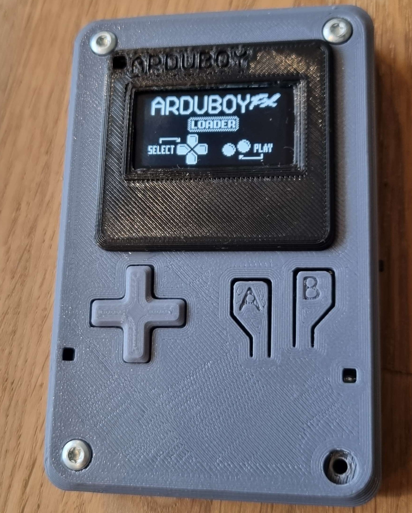
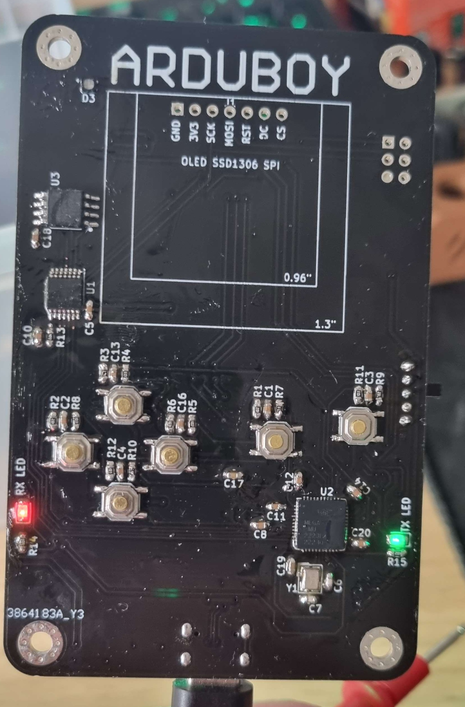
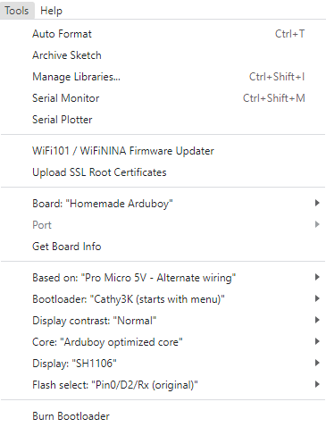

# Arduboy JM
My homebrew clone of arduboy - arduino-based handheld game console

For the original Arduboy please visit [their website](https://www.arduboy.com/)
 
 

## Description
This project differs a bit from the official arduboy. 
It follows the alternate **Pro Micro 5V alternate wiring**.
All buttons have pull-up resistors and debounce filter (resistor + capacitor).

Battery charging and 5V boost circuit is also a bit over-engineered - I stole that part from my other project idea that was meant for powering raspberry pi.
In theory it could deliver over 3A, if proper LiPo battery was used. 

It is a bit bigger - no longer credit-card sized, but I believe it makes it more comfortable to use. 

And since we're in 2023 already, I used USB-C connector instead of microUSB.
Also added ESD-protection IC on the USB port. 

This arduboy has the **FX-Mod** on board - a SPI-Flash chip to hold all the games.

  
## How to make one?
+ Install [KICAD](https://www.kicad.org/), open the project and generate gerber files (there are guides on how to do it depending on the manufacturer).

+ Order the PCB (I ordered mine at [JCLPCB](https://jlcpcb.com/), no issues so far).

+ Order the parts (all parts* are available at LCSC, but you can source your parts at different suppliers).

+ Solder everything together.

+ Flash the bootloader [*arduboy3k-bootloader-menu-promicro-sh1106.hex*](https://github.com/MrBlinky/cathy3k/tree/main/cathy3k)
 You will need avr isp programmer for that, like [AVRISP MKII](https://www.microchip.com/en-us/development-tool/ATAVRISP2), [USBASP](https://www.fischl.de/usbasp/) or [Arduino as ISP](https://docs.arduino.cc/built-in-examples/arduino-isp/ArduinoISP) and [AVRDUDE](https://github.com/mariusgreuel/avrdude/releases) installed.
 Flash the bootloader with following command (replace COM port and path to .hex file accordingly):
 
`avrdude -v -p m32u4 -c avrisp -B 22 -b 19200 -P COM4 -U flash:w:arduboy3k-bootloader-game-promicro-sh1106.hex:i`

+ Flash the flashcart 
 
This part is tricky, since it involves recompiling all games. On one hand, thanks to great people at arduboy.com, we are able to compile games for different hardware thanks to Homemade package.
 
On other hand, arduino IDE is a **BAD** IDE and it is tricky to automate the process (doing it by hand is annoying, since there are 300? 400? games available). 
    + Install [Arduino](https://www.arduino.cc/en/software) and [Homemade Package](https://github.com/MrBlinky/Arduboy-homemade-package)
    + Download [Python Utilities from MrBlinky](https://github.com/MrBlinky/Arduboy-Python-Utilities) (for building flashcard image)
    + Download game source (look for github repositories [here](http://www.bloggingadeadhorse.com/cart/Cart.html))
    + Set board settings like on the picture
     
    + Place the compiled .hex file in directory structure (check example from Python Utilities)
    + Build flashcart ([how](https://github.com/MrBlinky/Arduboy-Python-Utilities#flash-cart-builder))
    + Download [this project](https://github.com/MrBlinky/Arduboy-FX-mod-chip) to get GUI uploader - extract zip from `portable-activator`
    + Select your .bin file and click `Upload Flash image`

 

## Future
In the future I intend to work more on the software side of thise project.
Mainly, I wish to automate the build process, so a script would gather all the games, compile them, place in flashcart directory, generate CSV file and provide a complete BIN for the FX-Mod without manual labor.

 

### Display
I used cheaper SH1106 (SPI) display, but if you get ssd1306 then change your settings to fit (also get different bootloader file).

 

### Battery charging circuit warning
Charging current is related to capacity of the battery. 
Please change the R28 resistor accordingly if you are using smaller LiPos, cause they might not like 500mA charging current. I wouldn't set it to higher current either, cause then it might not work when connected to PC (you will connect to your PC to flash the games).

   
*all parts besides LiPo battery, piezo speaker and display
 Best source for display is ebay, aliexpress or your local online shop for makers.
Speakers can be extracted from old hardware, otherwise similar like display.
LiPo batteries are best bought from local shops, cause they dont want to send them by air, and the prices might vary greatly depending on your location. 
 
Also, you choose the battery you are okay with - differents shapes and sizes available. The project will work even with pretty small batteries, but nothing stops you from putting really big one if you want it. 
